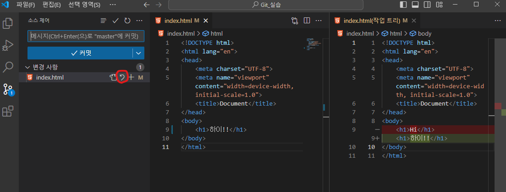

# Git (보충수업)

# 0. Git이  왜 필요한가?

- 포트폴리오 업로드용(취준생 기준 가장 많이 씀, 면접 자랑용)
- 히스토리 (잘못하면 돌아갈 수 있음)
- 협업 (같이 일할 때 branch pull request)

깃과 깃허브는 다르다

Q. 깃랩은 뭔가요?

A. 깃허브의 경쟁자

깃 - 버전관리 프로그램, 오프라인 가능

깃허브 - 깃 레포지토리를 웹에 올린 것(인터넷 있어야함) 리누즈토발즈

# 1. 설치(윈도우 기준)

cmd 창에서 

```bash
winget install Git.Git
```

터미널 한번 껏다 키고

```bash
git --version
```

먼저, 해당 컴퓨터에서 깃 사용이 처음이라면, 다음을 입력한다

```bash
git config --global user.name Carpediem324
git config --global user.name gusgkr0324@naver.com
```

# 2. 깃허브 원격 레포지토리 생성

그 다음, 깃허브에 레포지토리 하나 판다.

만들 때 알면 좋은 것들

1. Public / Private : 공개 비공개
2. **Add a README file : 왠만하면 X**
3. .gitignore :  무시할 파일 목록, 보안 상이나 용량이 지나치게 큰 것들 예외처리
4. license : 맘대로 해도되는지 ? 법률적 정보, 상업적 배포 등..

일단 README.md, gitignore, license는 사용 X

레포지토리 - 저장소

# 3. git 로컬 레포지토리 생성

```bash
echo "# SSAFY-first-repository" >> README.md
git init
git add README.md
git commit -m "first commit"
git branch -M main
git remote add origin https://github.com/Carpediem324/SSAFY-first-repository.git
git push -u origin main
```

### 3-1 git 레포지토리 생성

```bash
git init
```

위 명령어 입력 시 숨김 폴터로 .git이 생성된다.

현재 깃허브 레포지토리와 로컬 레포지토리는 연관이 없다. 연결해야한다

### 3-2 레포지토리 연결

```bash
git remote add origin https://github.com/Carpediem324/SSAFY-first-repository.git
```

연결하면 로컬 레포지토리가 github 레포지토리의 url을 갖고 있다. (연결X)

틀린 url을 적거나 잘못 적어도 상관이 없다. 다시 쳐주면 된다. 인터넷과 연관 X

### 3-2.1) 만약 주소를 잘못 적었다면?

```bash
git remote remove origin
```

# 4. git add

내가 깃에 올릴 것을 추가하는 명령어(로컬 git에)

일종의 장바구니! 장바구니에 담았다고 계산한 것이 아니다

```bash
git add ./추가해야할것
```

- git add . : 현재 경로 전부 추가
- git add -A : 현재 레포지토리의 모든 것 추가

.보다는 -A를 권장한다. 개발자는 디렉토리 이동할 일이 많기 때문에

# 5. git commit -m “~”

얼리기다!. add한 상태로 얼린다. 

반드시 메세지를 담아야한다.

```bash
git commit -m "나의 첫 커밋"
```



vscode의 기능 중 마지막 커밋으로 돌리기가 있다.! (소스 트리)

마지막 커밋과 비교하여 수정내역도 확인할 수 있다.

### 만약 여러 번 커밋한다면?

- 첫번째는 initial commit
- 두번째는 수정하고 commit
- 커밋 메세지를 잘 정하자!!!

# 6. git push

```bash
git push -u origin master
```

올린 걸 github에서 보면? 얼마나 수정했는지 확인할 수있다

github의 commits


---

여기까지 가장 기본이다. 여기까지만 하면 add push commit만 하는 깃무새다

branch 파서 full request하거나 이전 버전으로 돌리거나.. 많은 기능을 사용해야 한다

# 7. README.md

md는 Markdown언어로 작성하는 레포지토리 설명페이지이다!

# 8. git clone

레포지토리를 복사해오는 것이다.

```bash
git clone 주소
```

# 9. git pull

이미 clone해온 패키지가 업데이트되었다면?

지우고 clone하지말고 pull하자!!

(이미 컴퓨터에 해당 레포지토리가 존재해야 한다)

```bash
git pull origin master
```

